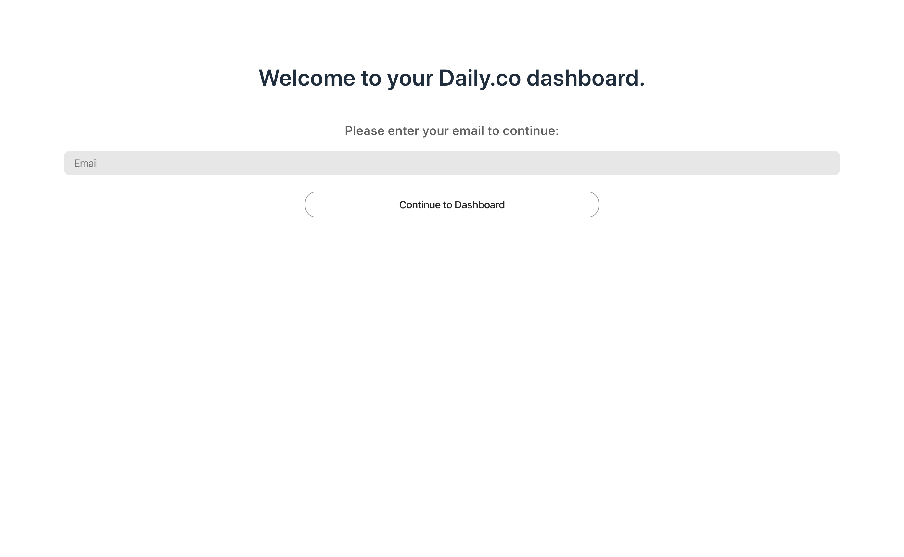
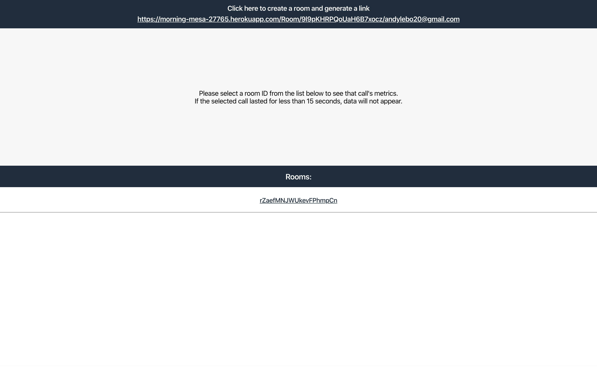
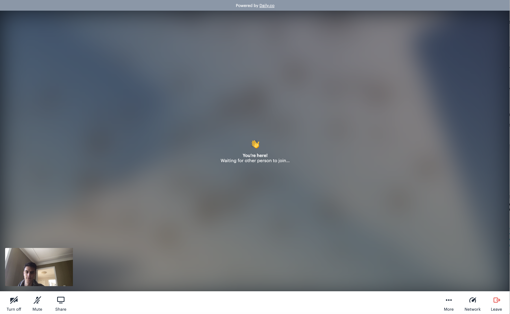
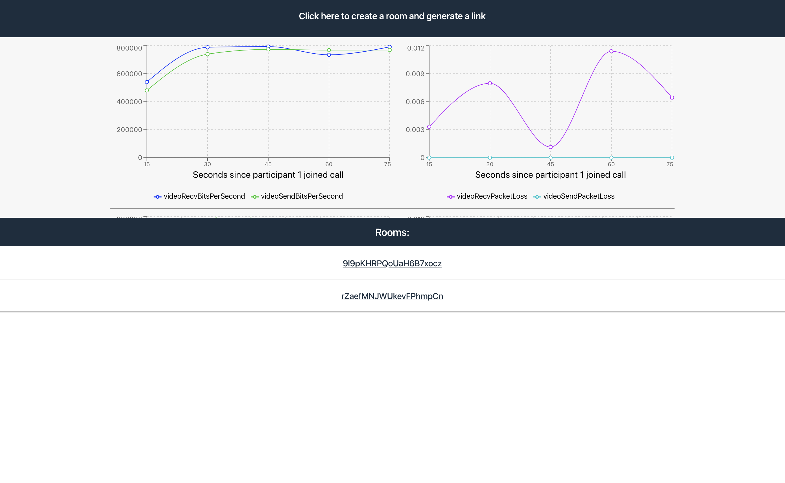

# dailydemo

This is a web application that lets people create and share video calls, then view network metrics about these calls.

## Technology Used

This project has a React frontend with a Node.JS & Express backend. 
The [daily.co API](https://docs.daily.co/docs) was used to easily create and embed video calls, as well as obtain metrics about these video calls. 
The [recharts library](http://recharts.org/en-US/) was used to graph the metrics of these video calls.

## How to setup in your local development environment:

These following instructions are for those using the Node Package Manager (npm).  
Please note that these instructions are primarily meant for those who have already installed the technologies mentioned above.

### 1. Clone the repo
Open your terminal and navigate to the directory where you want to store this project.  

Then, run the following command in your terminal:

`git clone https://github.com/andylebo20/dailydemo.git`

### 2. Install dependencies
Open up a second terminal window.  

In the *dailydemo* folder you just installed, there is a *frontend* folder.  
In one terminal window, navigate to this *frontend* folder.  
In the second terminal window, navigate to the root folder, *dailydemo*.  

In **both** terminal windows, run the following command:

`npm install`

By now, the project's *node_modules* folder and package files have been created and/or updated.

### 3. Run the project
In **both** terminal windows, run the following command:

`npm start`

### 4. In your browser, go to [http://localhost:3000](http://localhost:3000) to see the project in action! 🎉

## How to use

First, you will need to enter your email. 
Your email is used to identify yourself in the database and remember who the host is during calls.

To create a new call room, click the button at the top of the screen. A link to a new call room will be generated, which you can click on to join the call, or send it to others so they can join.

This is what a video call looks like. When you're done chatting, remember to click the **Leave** button in the bottom right. After doing so, your network metrics will be saved in the database.

To view each person's metrics from your call, click on the room name from the list of rooms. Then, graphs will display metrics from each participant in the call. You can scroll up/down to see other participants' metric graphs if there was more than one person in the call.

